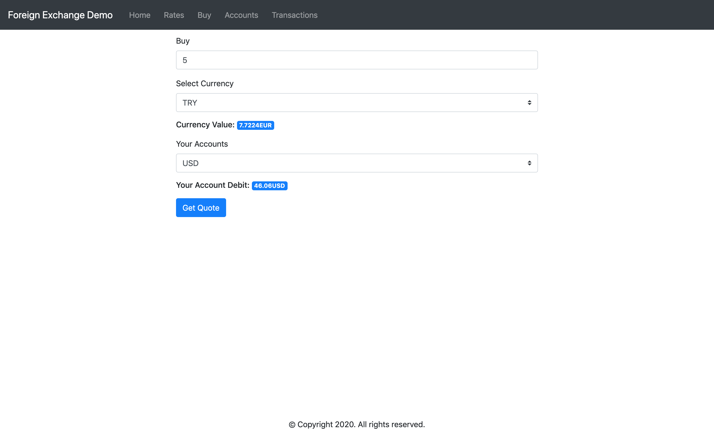

# assignmentOZAN

> 
This is a demo project, which demonstrates Microservice Architecture Pattern and Single Page Application Basics  using Spring Boot, Spring Cloud and Angular.
With a pretty good user interface, by the way.


Application has 5 subsections, which are called by Home, Rates, Buy, Accounts and Transactions respectively. When application is first started, 
you wil have a demo account with predefined currency and debit. These are USD account balanced with 100 credit and other is GBP account balanced with 80 credit.





## Functional services

Application was built on three core microservices. All are independently deployable applications organized around specific business areas.

#### Account service
Contains general user account logic and validation: items, savings and account settings. Below picture shows operations list accomplished by account-service. You can reach swagger UI of account service by clicking link http://localhost:5555/swagger-ui.html after running account-service.


#### Rate service
Rate service is responsible for getting current exchange rates. You can reach swagger UI of rate service by clicking link http://localhost:4444/swagger-ui.html after running rate-service.


#### Transaction service
Transaction service is responsible for creating transaction according to user inputs. You can reach swagger UI of rate service by clicking link http://localhost:7777/swagger-ui.html after running transaction-service.


## Installation

OS X & Linux:

```sh
npm install my-crazy-module --save
```

Windows:

```sh
edit autoexec.bat
```

## Usage example

A few motivating and useful examples of how your product can be used. Spice this up with code blocks and potentially more screenshots.

_For more examples and usage, please refer to the [Wiki][wiki]._

## Development setup

Describe how to install all development dependencies and how to run an automated test-suite of some kind. Potentially do this for multiple platforms.

```sh
make install
npm test
```

## Release History

* 0.2.1
    * CHANGE: Update docs (module code remains unchanged)
* 0.2.0
    * CHANGE: Remove `setDefaultXYZ()`
    * ADD: Add `init()`
* 0.1.1
    * FIX: Crash when calling `baz()` (Thanks @GenerousContributorName!)
* 0.1.0
    * The first proper release
    * CHANGE: Rename `foo()` to `bar()`
* 0.0.1
    * Work in progress

## Meta

Your Name – [@YourTwitter](https://twitter.com/dbader_org) – YourEmail@example.com

Distributed under the XYZ license. See ``LICENSE`` for more information.

[https://github.com/yourname/github-link](https://github.com/dbader/)

## Contributing

1. Fork it (<https://github.com/yourname/yourproject/fork>)
2. Create your feature branch (`git checkout -b feature/fooBar`)
3. Commit your changes (`git commit -am 'Add some fooBar'`)
4. Push to the branch (`git push origin feature/fooBar`)
5. Create a new Pull Request

<!-- Markdown link & img dfn's -->
[npm-image]: https://img.shields.io/npm/v/datadog-metrics.svg?style=flat-square
[npm-url]: https://npmjs.org/package/datadog-metrics
[npm-downloads]: https://img.shields.io/npm/dm/datadog-metrics.svg?style=flat-square
[travis-image]: https://img.shields.io/travis/dbader/node-datadog-metrics/master.svg?style=flat-square
[travis-url]: https://travis-ci.org/dbader/node-datadog-metrics
[wiki]: https://github.com/yourname/yourproject/wiki
